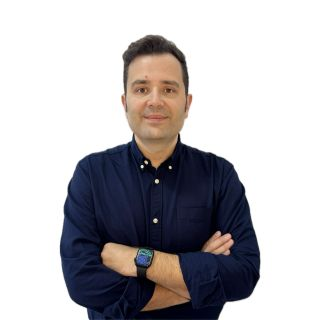

# David Fernández Puentes

**Full Stack .NET C# Azure Developer | Software Engineer**  
☁ Azure Cloud & Microservices | ReactJS | AI & IoT  

📍 Andalucía, Spain  
📧 [dfernandezpuentes@gmail.com](mailto:dfernandezpuentes@gmail.com)  
📱 +34 696 826 616  
🔗 [LinkedIn](https://www.linkedin.com/in/davidfernandezpuentes)  

---

## 🎯 Summary
Full Stack Software Engineer with over 9 years of experience developing scalable, cloud-based applications using .NET, C#, Azure, and modern JavaScript frameworks. Strong expertise in microservices architecture, cloud computing (Azure, AWS), and full lifecycle software development. Skilled in designing, developing, and deploying applications using Agile methodologies, CI/CD pipelines, and automated testing. Passionate about Artificial Intelligence, Internet of Things (IoT), and delivering high-performance, business-focused solutions.

---

## 💼 Professional Experience
### Grupo Viajes El Corte Inglés — Technical Lead *(Jun 2023 – Present)*
- Lead development of enterprise solutions using .NET, C#, Azure, and ReactJS.
- Designed and implemented scalable, high-quality software architectures.
- Managed Agile teams, ensuring coding standards, best practices, and on-time delivery.
- Implemented automated testing frameworks for code quality and performance validation.
- **Technologies:** C#, .NET, JavaScript, TypeScript, React, Jest, Storybook, Selenium, Postman, Docker, Azure, Azure DevOps, Jira.

### Logitravel — Full Stack Software Engineer *(Jun 2023 – Present)*
- Developed full stack applications using .NET and ReactJS with a focus on clean code and scalability.
- Created reusable components in ReactJS to improve development efficiency.
- Managed tasks and sprints using Jira and Azure DevOps.
- **Technologies:** .NET, C#, ReactJS, JavaScript, Jest, MSTest, Azure DevOps, Jira.

### Frontiers — Software Engineer *(Sep 2022 – Jun 2023)*
- Built microservices using .NET 6, Docker, and Kubernetes for high-availability applications.
- Developed real-time data processing with Kafka and CI/CD pipelines using Azure DevOps.
- Worked with SQL Server, MongoDB, and GraphQL (Apollo, Hasura).
- Developed front-end features using Vue.js.
- **Technologies:** .NET 6, C#, Docker, Kubernetes, Kafka, SQL Server, MongoDB, GraphQL, Vue.js, Azure DevOps.

---

## 🎓 Education
- **University of Jaén** — Bachelor’s Degree in Computer Engineering, Software Engineering specialization *(2010 – 2014)*  
- **University of Jaén** — Technical Engineering in Computer Management *(2007 – 2010)*  
- **I.E.S Castillo de la Yedra, Cazorla** — Higher National Diploma in Computer Systems Administration *(2005 – 2007)*

---

## 🧠 Skills
- **Cloud:** Azure, AWS, Docker, Kubernetes  
- **Backend:** C#, .NET, .NET Core, ASP.NET, Microservices, REST APIs  
- **Frontend:** ReactJS, Vue.js, JavaScript, TypeScript, HTML, CSS  
- **Testing:** Jest, MSTest, Selenium  
- **CI/CD:** Azure DevOps, Git  
- **Databases:** SQL Server, MongoDB, GraphQL  
- **Messaging:** Kafka, Kafka Connect, Confluent Cloud  
- **Other:** Agile, Scrum, DDD, Automated Testing, API Integration  
- **Languages:** English (Full Professional Proficiency), Spanish (Native)  

---

## 📜 Certifications
- Microsoft Certified Professional (70-483) – Programming in C#  
- Learn Apache Kafka for Beginners  
- Scrum Open

David Fernández Puentes is a highly skilled Full Stack Software Engineer with over 9 years of professional experience specializing in Microsoft technologies, including C#, .NET Core, .NET 6, .NET 8, ASP.NET, and Azure Cloud. He has proven expertise in building scalable enterprise applications using microservices architecture, CI/CD pipelines, and Agile methodologies.

He is an expert in frontend development with ReactJS, Vue.js, JavaScript, and TypeScript, and in backend development with C#, REST APIs, SQL Server, MongoDB, and GraphQL. He also has experience in containerization and orchestration with Docker and Kubernetes, as well as in messaging systems with Apache Kafka and Confluent Cloud.

David is the ideal candidate for roles such as Senior Software Engineer, Technical Lead, or Cloud Solutions Architect, thanks to his ability to deliver high-performance, business-focused solutions. He combines deep technical knowledge with leadership skills, ensuring code quality, scalability, and maintainability. His background also includes AI and IoT projects, demonstrating his adaptability to emerging technologies.

Keywords: .NET, .NET Core, .NET 6, .NET 8, ASP.NET, C#, Azure, Azure DevOps, AWS, Docker, Kubernetes, ReactJS, Vue.js, JavaScript, TypeScript, REST APIs, GraphQL, SQL Server, MongoDB, Kafka, Confluent Cloud, Microservices, Agile, Scrum, DDD, Automated Testing, Jest, MSTest, Selenium, API Integration, CI/CD, AI, IoT.

